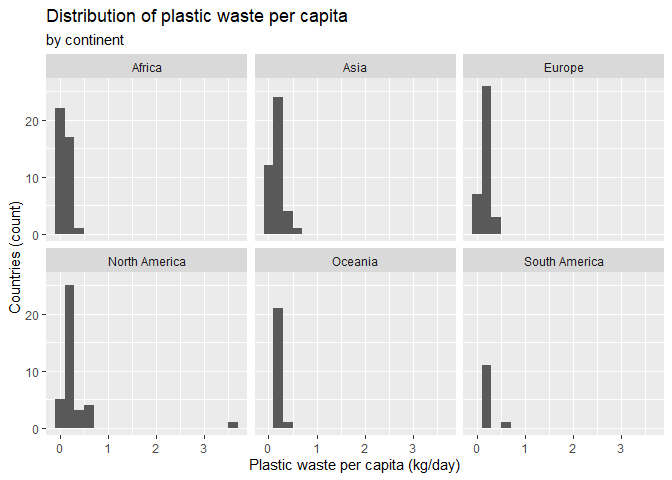
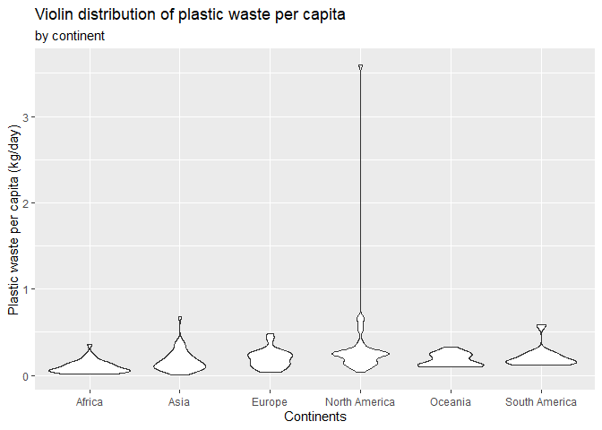
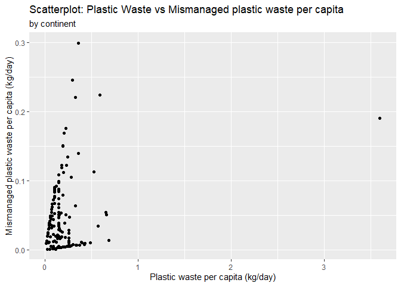
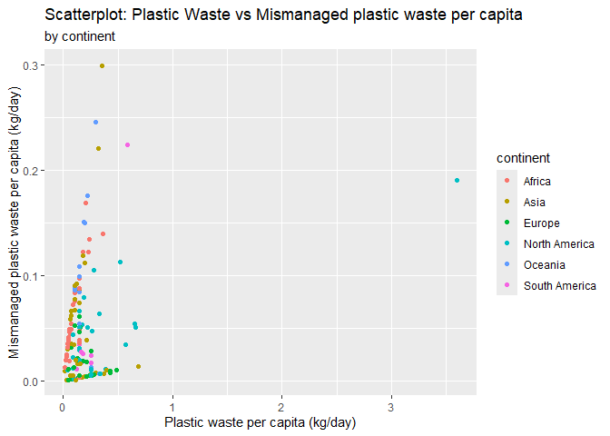
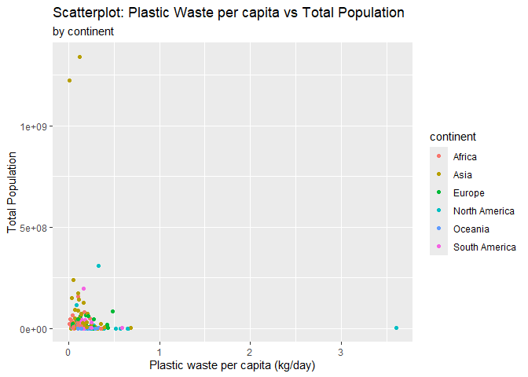
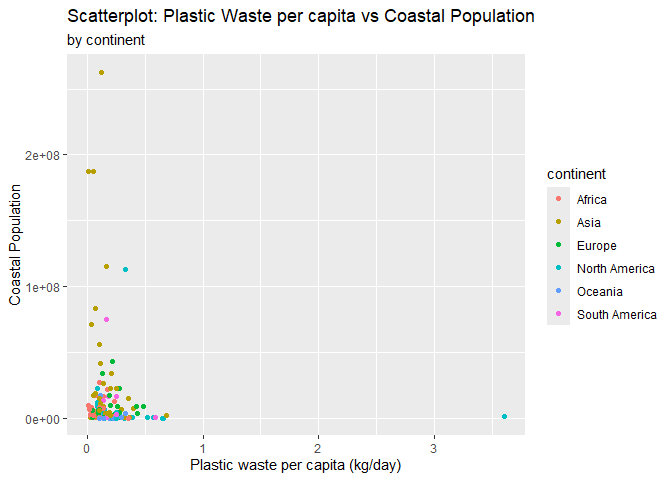

Lab 02 - Plastic waste
================
Tsion
01/31/2026

## Load packages and data

``` r
library(tidyverse) 
```

``` r
plastic_waste <- read.csv("data/plastic-waste.csv")
```

Data Visualization: (Before starting exercise: For my own practice and
to look back on later)

``` r
ggplot(data = plastic_waste, aes(x = plastic_waste_per_cap)) +
  geom_histogram(binwidth = 0.2)
```

    ## Warning: Removed 51 rows containing non-finite outside the scale range
    ## (`stat_bin()`).

<!-- -->

``` r
plastic_waste %>%
  filter(plastic_waste_per_cap > 3.5)
```

    ##   code              entity     continent year gdp_per_cap plastic_waste_per_cap
    ## 1  TTO Trinidad and Tobago North America 2010    31260.91                   3.6
    ##   mismanaged_plastic_waste_per_cap mismanaged_plastic_waste coastal_pop
    ## 1                             0.19                    94066     1358433
    ##   total_pop
    ## 1   1341465

## Exercises

### Exercise 1

``` r
ggplot(data = plastic_waste, aes(x = plastic_waste_per_cap)) +
  geom_histogram(binwidth = 0.2) + 
  facet_wrap(~continent) + 
  labs( 
    title = "Distribution of plastic waste per capita",
    subtitle = "by continent",
    x = "Plastic waste per capita (kg/day)",
    y = "Countries (count)"
    )
```

    ## Warning: Removed 51 rows containing non-finite outside the scale range
    ## (`stat_bin()`).

<!-- -->


    ### Exercise 2


    ``` r
    ggplot(
      data = plastic_waste,
      mapping = aes(
        x = plastic_waste_per_cap,
        color = continent,
        fill = continent
      )
    ) +
      geom_density(alpha = 0.3) + 
      labs (
      title = "Distribution of plastic waste per capita",
        subtitle = "by continent",
        x = "Plastic waste per capita (kg/day)",
        y = "Countries (density)")

    ## Warning: Removed 51 rows containing non-finite outside the scale range
    ## (`stat_density()`).

<!-- -->

2.2. The reason why we defined ‘color’ and ‘fill’ under mapping
aesthetics of the plot is because these are characteristics that are
based on (vary by) the values in the data (for example here, different
color and fill show each continent). On the other hand, for the alpha,
this is a characteristics that is not based on the values of the data
for our current purpose (we are changing the transparency level of the
fill color to help with the overlapping colors of the continents making
it hard to effectively visualize the data). So, we define it here a a
characteristic of the plotting geom (setting).

### For my own practice (to refer back later)

``` r
ggplot(
  data = plastic_waste,
  mapping = aes(
    x = continent,
    y = plastic_waste_per_cap
  )
) +
  geom_boxplot() +
  labs (
  title = "Boxplot distribution of plastic waste per capita",
    subtitle = "by continent",
    x = "Continents",
    y = "Plastic waste per capita (kg/day)")
```

    ## Warning: Removed 51 rows containing non-finite outside the scale range
    ## (`stat_boxplot()`).

<!-- -->

\*Note: To zoom in to the box plots and not have it compressed by the
outlier, you can add:

``` r
ggplot(
  data = plastic_waste,
  mapping = aes(
    x = continent,
    y = plastic_waste_per_cap
  )
) +
   geom_boxplot(width = 0.7) +
  coord_cartesian(ylim = c(0, 0.6)) +
  labs (
  title = "Boxplot distribution of plastic waste per capita",
    subtitle = "by continent",
    x = "Continents",
    y = "Plastic waste per capita (kg/day)")
```

    ## Warning: Removed 51 rows containing non-finite outside the scale range
    ## (`stat_boxplot()`).

<!-- -->

### Exercise 3

``` r
ggplot(
  data = plastic_waste,
  mapping = aes(
    x = continent,
    y = plastic_waste_per_cap
  )
) +
  geom_violin() +
  labs (
  title = "Violin distribution of plastic waste per capita",
    subtitle = "by continent",
    x = "Continents",
    y = "Plastic waste per capita (kg/day)")
```

    ## Warning: Removed 51 rows containing non-finite outside the scale range
    ## (`stat_ydensity()`).

<!-- -->

3.1. The violin distributions give us more information about the shape
of the distriution, compared to box plots. Violin plots are a
combination of a box plot and density plot. For example, if we look at
the plot for Africa, we can see that it is wider at the bottom (a
triangle shape), which shows us that most countires in Africa are in the
low range for plastic waste per cap.

On the other hand, violin plots aren’t as effective as box plots when it
comes to identifying outliers, and also if we want to present a more
simplified way to visualize/interpret data. So, it depends on our goal
which one we would like to use, as they both have their own advantages.

### Exercise 4

### 4.1

``` r
ggplot (
data = plastic_waste,
mapping = aes(
x = plastic_waste_per_cap,
y = mismanaged_plastic_waste_per_cap
)
) + 
geom_point() +
labs (
  title = "Scatterplot: Plastic Waste vs Mismanaged plastic waste per capita",
    subtitle = "by continent",
    x = "Plastic waste per capita (kg/day)",
    y = "Mismanaged plastic waste per capita (kg/day)")
```

    ## Warning: Removed 51 rows containing missing values or values outside the scale range
    ## (`geom_point()`).

<!-- -->

Most countries seem to be piled up near the lower values of plastic
waste per capita. It appears like there is some upward trend going on in
the lower values, but we can’t know much at this point since there is no
distinction between the continents. As we saw from previous
visualizations, we can also see clearly there is one clear outlier that
is further out more than 3kg/day.

### 4.2

``` r
ggplot (
data = plastic_waste,
mapping = aes(
x = plastic_waste_per_cap,
y = mismanaged_plastic_waste_per_cap,
color = continent
)
) + 
geom_point()  +
labs (
  title = "Scatterplot: Plastic Waste vs Mismanaged plastic waste per capita",
    subtitle = "by continent",
    x = "Plastic waste per capita (kg/day)",
    y = "Mismanaged plastic waste per capita (kg/day)")
```

    ## Warning: Removed 51 rows containing missing values or values outside the scale range
    ## (`geom_point()`).

<!-- -->

I don’t think there is a very obvious distinction between the continents
since they are very clustered together. But it also looks like most
continents follow somewhat upward of a pattern.As the plastic waste per
capita increases, there mostly seems to be an increase with the
mismanaged plastic waste per capita for the continents (the least
obvious in this trend seems to be South America). The extreme outlier we
idenitifed belongs to North America.

### 4.3

``` r
ggplot (
data = plastic_waste,
mapping = aes(
x = plastic_waste_per_cap,
y = total_pop,
color = continent
)
) + 
geom_point()  +
labs (
  title = "Scatterplot: Plastic Waste per capita vs Total Population",
    subtitle = "by continent",
    x = "Plastic waste per capita (kg/day)",
    y = "Total Population")
```

    ## Warning: Removed 61 rows containing missing values or values outside the scale range
    ## (`geom_point()`).

<!-- -->

There doesn’t seem to be a clear/strong linear relationship, it’s not
very clear since they are clustered very much.

``` r
ggplot (
data = plastic_waste,
mapping = aes(
x = plastic_waste_per_cap,
y = coastal_pop,
color = continent
)
) + 
geom_point() +
labs (
  title = "Scatterplot: Plastic Waste per capita vs Coastal Population",
    subtitle = "by continent",
    x = "Plastic waste per capita (kg/day)",
    y = "Coastal Population")
```

    ## Warning: Removed 51 rows containing missing values or values outside the scale range
    ## (`geom_point()`).

<!-- -->

### Exercise 5

``` r
# insert code here
```
